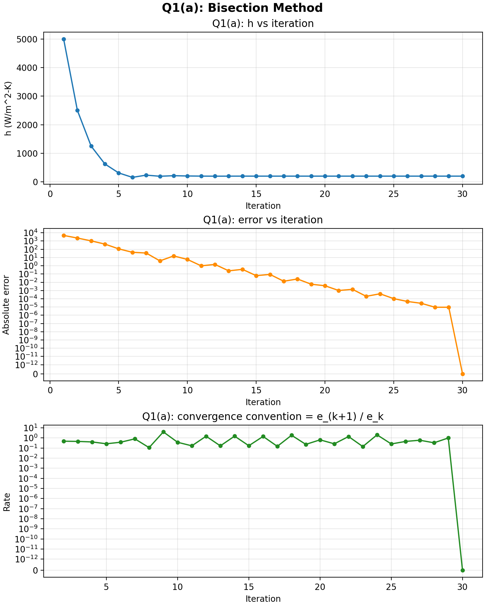
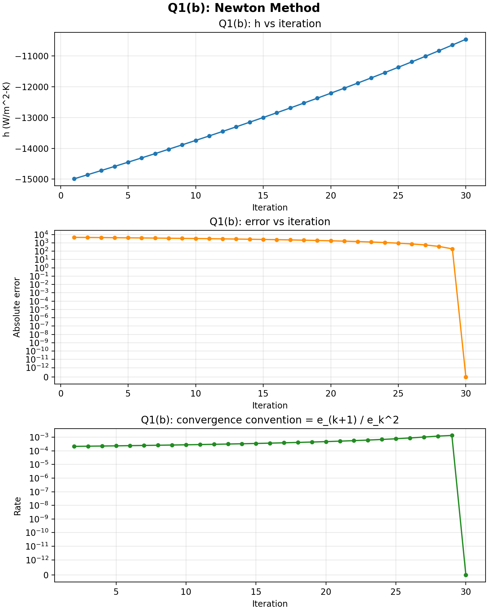
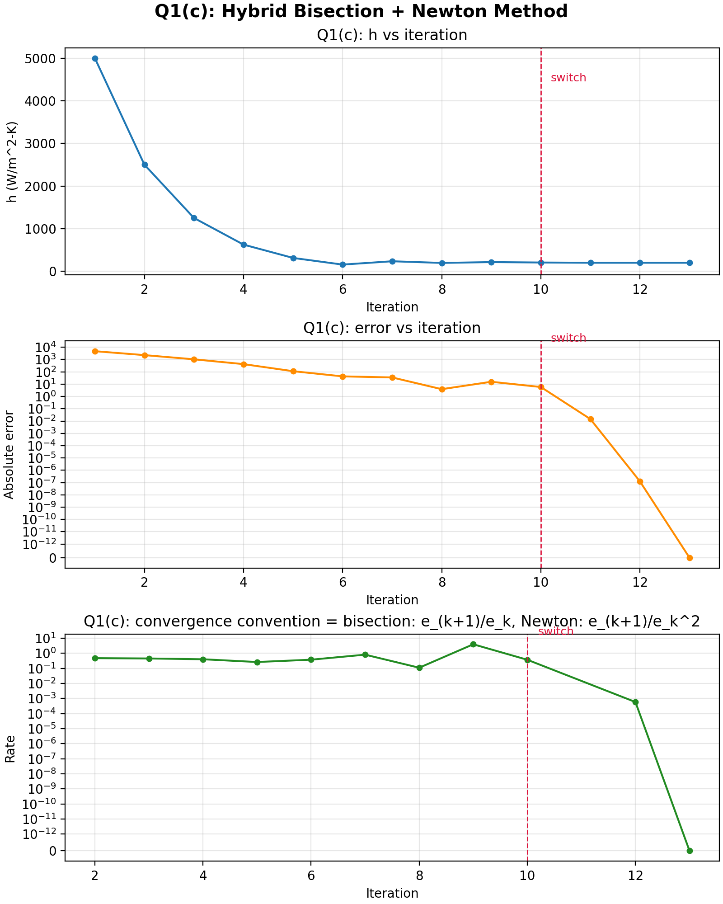

# Assignment 04 Report

## 1. Problem statement

The scanned assignment asks for:

- a bisection solution for the convection coefficient `h`
- a Newton solution for the same nonlinear equation
- a hybrid bisection-Newton solution
- convergence plots and error tracking for the scalar root-finding problem
- a Newton-Raphson solution of a 3-variable nonlinear system from two different starting guesses

The cleaned question transcription is available in `question.txt`. The implementation is split into `src/q1a.cpp`, `src/q1b.cpp`, `src/q1c.cpp`, and `src/question2.cpp`.

## 2. Mathematical model for Problem 1

Because the coating is negligibly thin, the measurement location is taken at the surface, so `z = 0`.

The semi-infinite convection relation therefore reduces to:

```text
(T_s - T_i) / (T_inf - T_i) = 1 - exp(beta^2) * erfc(beta)
beta = h * sqrt(alpha * t) / k
```

Using the assignment data:

- `T_i = 25 C`
- `T_inf = 300 C`
- `T_s = 53.5 C`
- `alpha = 1e-4 m^2/s`
- `k = 400 W/m-K`
- `t = 400 s`

the target temperature ratio becomes:

```text
(53.5 - 25) / (300 - 25) = 0.1036363636
```

So the scalar root-finding problem is:

```text
f(h) = 1 - exp(beta^2) * erfc(beta) - 0.1036363636 = 0
```

The code evaluates `erf(beta)` numerically with the trapezoidal rule using `N = 51`, exactly as suggested in the assignment.

## 3. Numerical results for Problem 1

### 3.1 Bisection

- Initial interval: `[1, 10000]`
- Tolerance: `1e-5`
- Iterations: `30`
- Final result: `h = 200.1968781305 W/m^2-K`

This method converges reliably because the interval brackets the root, but it is slower than the hybrid method.



### 3.2 Newton's method

- Initial guess: `h = 5000`
- Tolerance: `1e-5`
- Maximum iterations used: `30`
- Outcome: did not converge

Newton's method diverges here because the starting guess is too far from the physically meaningful root near `200 W/m^2-K`. The very first update jumps to a large negative value, and subsequent iterations remain far from the actual root. This is a standard weakness of Newton's method: it is fast only when the initial guess is already close to the correct basin of attraction.



### 3.3 Hybrid method

- Bisection steps before switching: `10`
- Total iterations: `13`
- Final result: `h = 200.1968770910 W/m^2-K`

This is the best practical method in this assignment. The first 10 bisection steps safely move the iterate close to the root, and the Newton steps then finish the job quickly with quadratic convergence.



### 3.4 Interpretation

Among the convergent methods, the physical convection coefficient is:

```text
h ~= 200.197 W/m^2-K
```

The bisection and hybrid answers agree to many decimal places. The hybrid method reaches that answer much faster than plain bisection, while pure Newton fails from the required initial guess.

## 4. Numerical results for Problem 2

The nonlinear system solved in the code is:

```text
f1(x,y,z) = x + y + z - 3
f2(x,y,z) = x^2 + y^2 + z^2 - 5
f3(x,y,z) = e^x + x y - x z - 1
```

Its Jacobian is:

```text
[ 1              1      1 ]
[ 2x             2y     2z ]
[ e^x + y - z    x     -x ]
```

The `src/question2.cpp` program applies multivariable Newton-Raphson to the two starting guesses from the question.

### Starting guess 1

```text
x^(0) = [0.1, 1.2, 2.5]^T
```

Converged in `22` iterations to:

```text
[0.0000000067, 0.9999999865, 2.0000000067]
```

which is effectively:

```text
[0, 1, 2]
```

### Starting guess 2

```text
x^(0) = [1, 0, 1]^T
```

Converged in `6` iterations to:

```text
[1.2243943234, -0.0931331386, 1.8687388151]
```

### Do both initial guesses converge to the same root?

No.

The system has multiple valid roots, and Newton-Raphson is a local method. A local method does not guarantee convergence to the same solution from different starting points. Each initial guess falls into a different basin of attraction, so the iterations converge to different roots.

## 5. Files generated by the solution

Running `./q1a` creates:

- `output/q1a_summary.txt`
- `output/q1a_bisection.csv`

Running `./q1b` creates:

- `output/q1b_summary.txt`
- `output/q1b_newton.csv`

Running `./q1c` creates:

- `output/q1c_summary.txt`
- `output/q1c_hybrid.csv`

Running `./q2` creates:

- `output/q2_summary.txt`
- `output/q2_guess1.csv`
- `output/q2_guess2.csv`

Running `python3 plot_results.py` creates:

- `output/plots/q1a_bisection_history.png`
- `output/plots/q1b_newton_history.png`
- `output/plots/q1c_hybrid_history.png`

## 6. Final conclusion

- The required convection coefficient is approximately `200.197 W/m^2-K`.
- Pure Newton's method is not reliable here with the required initial guess `5000`.
- The hybrid bisection-Newton method is the most efficient convergent approach.
- The two starting guesses for the nonlinear system converge to different roots because the system is nonlinear and has multiple attraction basins.
